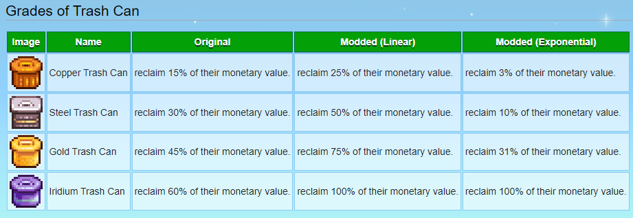

# Better Trash Can

When trashing an item, you reclaim upto 100% of the value. It changes the default reclamation percentages for Trash Cans progression and allows two configurations for the progression, "Linear" or "Exponential". See the reference table below.

## Reference Table

## See also
---

- [Release notes](Changelog.md)
- [Nexusmods page](https://www.nexusmods.com/stardewvalley/mods/11814)
